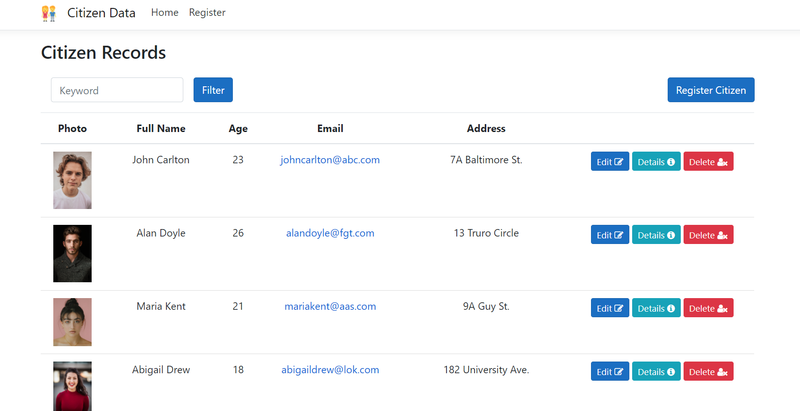

# Citizen-Data

 ASP.Net Core App that collects biodata for citizens 

Live Demo Available [Here](http://citizendata.azurewebsites.net/)

# Images



# Features Test
- Responsive web design
  - [See mobile emulators](http://www.responsinator.com/?url=citizendata.azurewebsites.net%2F)
  - Meets highest accessibility standards 
  - [Run accessibility validator](https://wave.webaim.org/report#/http://citizendata.azurewebsites.net/)
- High performance. Gets 79/100 points on Google PageSpeed Insights for Desktop
  - [Run PageSpeed Insights](https://developers.google.com/speed/pagespeed/insights/?url=http%3A%2F%2Fcitizendata.azurewebsites.net%2F&tab=desktop)


# How to use

On the command line, install the template.

```cmd
cd CitizenData.Web
dotnet restore
dotnet run
```

After the command shell indicates that the app has started, browse to 

```cmd
https://localhost:5001
```
